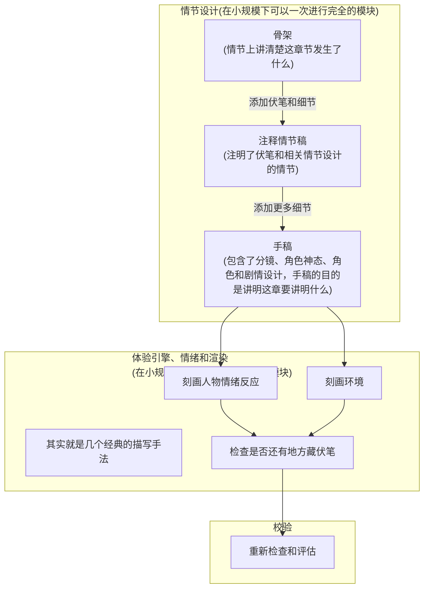
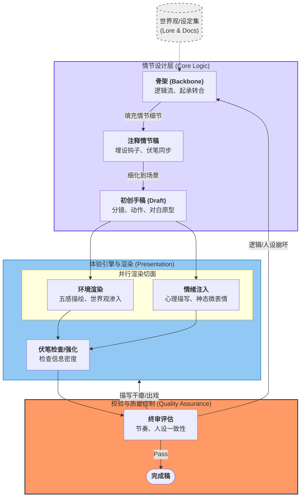

这里的写作技术是在观察各种作品中观察出来得到的，所以它可能不一定正确。  
  
当然，你也可以在这里看到我的独创技术。  
  
## 写作第一性原理  
*其实也是创作原理，也就是以目标体验为中心。*  
  
很简单，**以写作目的为中心**。这个原理不止适用与小说创作，也适用于应用文。  
  
这是从写作本质谈起的技术：写作本质是传达思想。所以写作时的一切技巧都是要以写作目标为中心的。如果你要写技术报告，你的目的是让其他人也能看懂技术，那你的一切技术应用都应该能促进目标，而非阻碍目标。如果你要写正式文书，你的目的是正式声明，那你就应该往无歧义、正式、遵循礼节上靠。  
  
这也引出了 **技术使用原理**：是否应该应用一项技术，取决于技术是否有益于最终目标。  
  
在这里，小说的目标**通常**是为了创作出不存在的虚拟体验或是讲述一个故事。  

## 注意点分离
*也就是所说的「大纲-草稿」写法.*

> [!WARNING]
> 启发自 AOP 面向切面编程。方法未经验证。

在写作的过程中，有太多方面需要关注，这样搞得心力过度。而如果能将相互之间关系并不紧密的方面进行适当分离，可以减轻压力，专注一个方面进行工作，再通过 pipeline 对草稿不断完善，效果也许会比一次草稿后修改好。

虽然说是「大纲-草稿」法，但是并不是完全的分离，而是在对同一个稿件的基础上进行不断的完善，就像在 3D 渲染中，通过渲染管线对数据进行一次次加工，最终得到完善而有质量的画面。

同时，pipeline 的建立也意味着多人协作写作变得可能，当然也包括 AI 人机协作。

比如说建立一个简单的 pipeline （我现在在用的、我命名其为 `Archmetric` 的 pipeline），如下：

**当然，最重要的是，不需要完全遵循管线设计。因为灵感从来不会按管线来，想到什么就写什么就行了。但是重要的是，搞清楚手稿到底在哪个阶段，这样才知道手稿需要补全什么。**

*附上 AI 改动后的版本，可能比我设计得更清楚：*

## 动作  

**当然，最重要的是，不需要完全遵循管线设计。因为灵感从来不会按管线来，想到什么就写什么就行了。但是重要的是，搞清楚手稿到底在哪个阶段，这样才知道手稿需要补全什么。**滤镜原理  
*即动作主观化或客观化.*  
  
**这个不是写作技巧，而是自然存在与语言中的暗示。**  
  
原理是这样的：在人表达语言的时候，不同的人（因为不同的先验知识）看到不同的语言会有不同的反应，从而产生不同的理解。就像一个倒霉到家的人跟朋友吐槽说自己很倒霉，但是得到了「你很好了」这样的回应，如果这个倒霉到家的傢伙先天认为这个朋友本身就是迟钝的傢伙，就会觉得不被理解。但是如果从其他人但看这段角度来说，朋友可能是理解了，试图安慰这个可怜人。  
  
需要注意的是，人的性格同样是一种先验知识，所以即便是在情报上大家知道一样，但是看一个动作得到的理解都是不同的。  
  
一个比较简单的应用就是通过对角色动作的描写，附上作者的暗示。  
  
比如说「她脸忽地又一红，举起书，目光却又不在书上，瞄着别的地方。」中，形容了一个少女因为羞涩而掩饰的动作，作者其实可以附上作者视角的暗示「她脸一下子红，举起书挡住脸，目光在书上游移，最终瞟着别的地方。」  
  
少女举起书是为了「挡住」，但是原文没有凸显出来，因为从作者的角度看，这只是一个普通的动作。但是从少女的角度看，这是为了掩饰羞涩。作者可以通过添上几个字的暗示和小动作刻画，来强调少女这种羞涩。读者看得也会更明白。  
  
## 环境协同暗示  
*随口一糊的，可能会面会删掉这个技术。*  
  
通过对角色动作的描写，暗示其行为动机与内心状态，从而将客观叙述转化为特定视角下的主观体验。  
  
最简单的就是因为主角心情差劲，所以作者特意安排了雨天或者热闹的节日，来达成环境共鸣或者环境反差。  
  
这个技术可以形成明显的暗示