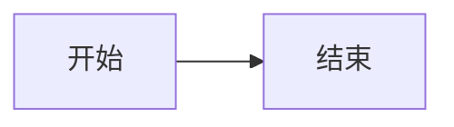
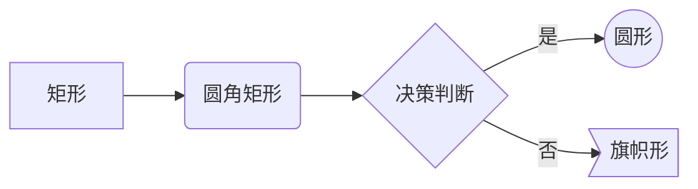
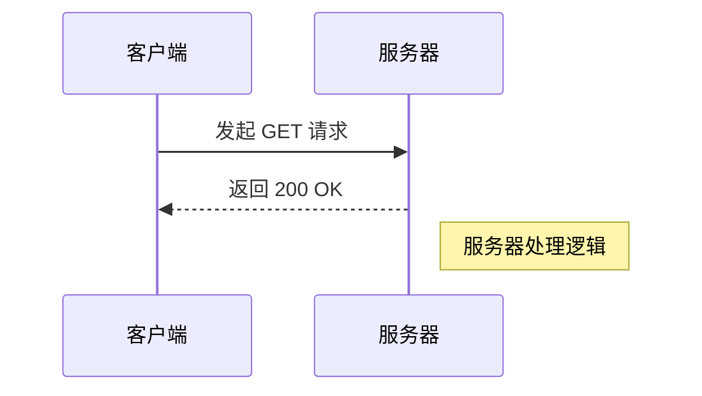
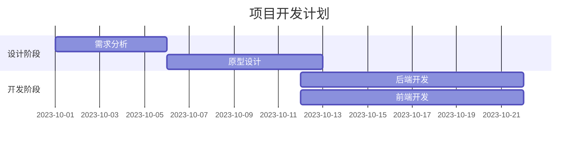
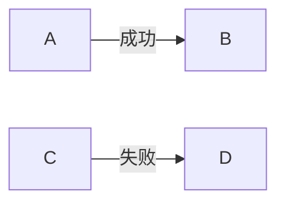
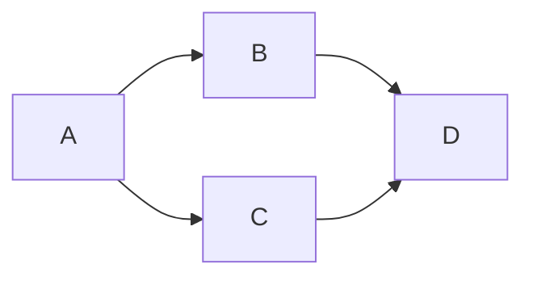
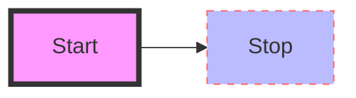
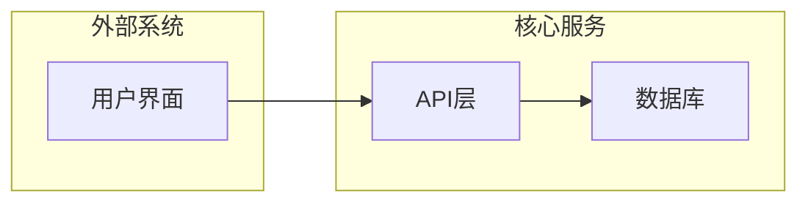

> [!WARNING]
> 本文主要内容由 AI 生成，如有介意请不要观看此页面。

Mermaid 是一种基于 Markdown 的图表绘制工具，它允许你使用简单的文本代码生成流程图、时序图、甘特图等。对于开发者和文档撰写者来说，它是实现“文档即代码”（Documentation as Code）的神器。

## 基础语法结构

Mermaid 的代码块通常包裹在 Markdown 的代码围栏中：

```
graph LR
    %% 这是一个注释
    A[开始] --> B[结束]
```



**常用方向标识：**
- **TB / TD**: 从上到下 (Top to Bottom / Top Down)
- **BT**: 从下到上 (Bottom to Top)
- **LR**: 从左到右 (Left to Right)
- **RL**: 从右到左 (Right to Left)

## 核心图表类型

### 流程图

```
graph LR
    A[矩形] --> B(圆角矩形)
    B --> C{决策判断}
    C -- 是 --> D((圆形))
    C -- 否 --> E>旗帜形]
```



- **节点形状**：`[]` 矩形，`()` 圆角，`{}` 菱形，`(())` 圆形。
- **连线**：`-->` 实线箭头，`---` 实线无箭头，`-.->` 虚线箭头，==> 加粗箭头。

### 时序图

用于描述对象之间的交互顺序。

```
sequenceDiagram
    participant 客户端
    participant 服务器
    客户端->>服务器: 发起 GET 请求
    服务器-->>客户端: 返回 200 OK
    Note right of 服务器: 服务器处理逻辑
```



### 甘特图

```
gantt
    title 项目开发计划
    dateFormat  YYYY-MM-DD
    section 设计阶段
    需求分析 :a1, 2023-10-01, 5d
    原型设计 :after a1, 7d
    section 开发阶段
    后端开发 :2023-10-12, 10d
    前端开发 :2023-10-12, 10d
```



## 进阶样式

### 箭头上写字

可以用这两种办法给箭头写字

```
graph LR
    A -- 成功 --> B
    C -->|失败| D
```



### 一次连接多个节点

```
graph LR
    A --> B & C --> D
```



### 节点样式定制

你可以通过 `style` 关键字为特定节点着色：

```
graph LR
    Start --> Stop
    style Start fill:#f9f,stroke:#333,stroke-width:4px
    style Stop fill:#bbf,stroke:#f66,stroke-dasharray: 5 5
```


### 子图 (Subgraphs)

将相关的节点组织在一起：

```
graph TB
    subgraph 外部系统
        A[用户界面]
    end
    subgraph 核心服务
        B[API层] --> C[数据库]
    end
    A --> B
```



