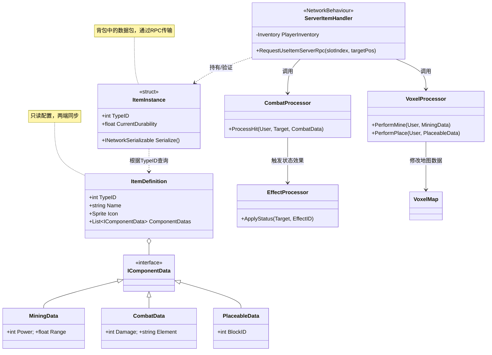

最近在研究物品组件架构如何设计。也就是说，通过组件组合来实现游戏物品。

## 主要思路

*其实就是 ECS 那套.*

组件化的物品使用数据来进行完全的物品定义，而让系统或执行者来根据组件数据进行多样化的行为。

所以在这种架构里，物品是纯粹的数据定义，而系统才是执行行为的主体。

此外，标签系统也是一种物品系统（不过其数据只是一个存储标签的键值字典`<string, bool>`）

## 没有网络同步的简单版本

*先从没有网络同步的版本来思考。*

### 物品实体模型

这个模型由三部分组成，分别是存储物品数据的`ComponentData`，存储组件列表的`ComponentList`物品基类和使用组件来进行操作的`ItemProcessors`物品执行器。

以解耦传统的`Item`类来示范，如一个可以发光并且有耐久机制的打火机可以拆成`Lighter`有光源组件`Lightable`、耐久组件`Durability`、用于标识物品信息的标识符组件`Identity`。

在系统需要实现物品行为的时候，由`ItemProcessors`来根据物品执行。

比如说玩家手持矿稿点击地面的时候`MiningSystem`或者`MapSystem`就会来读取玩家手中物品信息`Item`然后搜索组件来执行行为。

就像 ECS 一样把物品拆解了。

在数据驱动的加持下，这样极大增加了物品实现的灵活性和可扩展性（可以轻松实现新的物品），不过代价是调试困难以及代码复杂度提高。

### 组件的管理

#### 组件依赖

在组合时，会遇到组件相互依赖的问题（例如：攻击组件`Attackable`需要装备`Equipable`组件才能生效）。

一个简单有效的方式是：
- **组件检查：** 在添加 `AttackComponent` 时，代码检查是否存在 `EquipableComponent`。 

而更加灵活的方式是：
- **黑板模式 (Blackboard)：** 物品实体上维护一个公共的数据字典，所有组件都可以读写这个字典来共享状态。 *备注：一个示例就是用黑板模式来构建伤害计算公式，不管底下的组件怎么互相影响，最终都以黑板计算结果为主。*

## 附录

